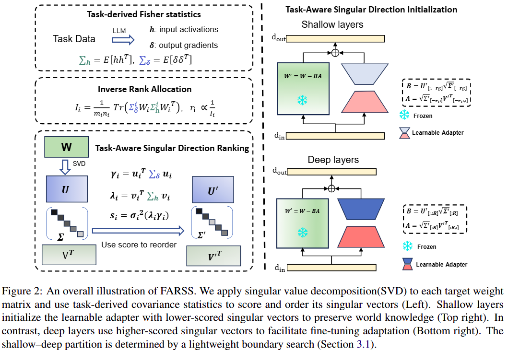

# [ACL Findings 2026] FARSS: Fisher-Optimized Adaptive Low-Rank and Singular-Vector Selection for Knowledge-Preserving Fine-Tuning

The official repository containing the introduction and code for our ACL Findings 2026 paper: FARSS: Fisher-Optimized Adaptive Low-Rank and Singular-Vector Selection for Knowledge-Preserving Fine-Tuning.

## Introduction
Parameter-efficient fine-tuning (PEFT) has become a prevalent approach for adapting large language models (LLMs). However, low-rank adaptation methods face an inherent trade-off: improving target task performance can compromise pre-trained world knowledge, while aggressively constraining updates to preserve world knowledge may hinder improvements in the target task. Furthermore, most current methods fail to account for layer-wise differences in adaptation sensitivity, resulting in suboptimal preservation of world knowledge and task adaptation. To address these challenge, we propose Fisher-Optimized Adaptive Low-Rank and Singular-Vector Selection (FARSS), an effective framework for knowledge-preserving fine-tuning. This framework introduces two key innovations. First, we propose a Fisher-guided adaptive rank allocation strategy, which assigns smaller ranks to shallow layers that are critical for preserving world knowledge, and larger ranks to deep layers that are essential for task adaptation. Second, we introduce a task-aware initialization method that integrates singular value information with layer-specific second-order statistics estimated from activation and gradient covariances, enabling efficient and task-sensitive low-rank updates. We evaluated several models across various tasks, and the experimental results show that our approach outperforms existing PEFT methods, including LoRA, Corda, and KaSA, achieving a balance between preserving world knowledge and enhancing target task performance.



## Quick Start
Make sure your CUDA driver/toolkit is compatible with cu128.
```
git clone https://github.com/chenyehuang/FARSS.git
cd FARSS
conda create -n farss python=3.11
conda activate farss
pip install -r requirements.txt
```

### Init
```bash
mkdir -p ./llama/svd_init_models
mkdir -p ./llama/logs/init
mkdir -p ./llama/logs/init/svd

CUDA_VISIBLE_DEVICES=0,1,2,3,4,5,6,7 \
TOKENIZERS_PARALLELISM=false \
NCCL_ASYNC_ERROR_HANDLING=1 \
SVD_LOG_ENABLE=1 \
SVD_LOG_STDOUT=0 \
SVD_LOG_FILE=./llama/logs/init/svd/svd_init.jsonl \
PYTHONUNBUFFERED=1 \
python init.py \
--model_path meta-llama/Llama-2-7b-hf \
--save_path ./llama/svd_init_models \
--task_name math \
--hf_dataset meta-math/MetaMathQA  \
--hf_split 'train[:256]' \
--svd_rank 128 \
--lora_alpha 128 \
--init_method grad-kfac \
--amp_dtype bf16 \
--max_len 512 \
--layers_split 1 \
--layer_split_start 6 \
2>&1 | tee ./llama/logs/init/init-code-grad-kfac-r64.log
```

### Train
```bash
export TOKENIZERS_PARALLELISM=false
export TORCH_NCCL_ASYNC_ERROR_HANDLING=1
unset NCCL_ASYNC_ERROR_HANDLING
export NCCL_IB_DISABLE=0
export NCCL_P2P_DISABLE=0
export CUDA_VISIBLE_DEVICES=0,1,2,3,4,5,6,7

PYTHONUNBUFFERED=1 deepspeed \
  --master_addr 127.0.0.1 \
  --master_port 29501 \
  --include localhost:0,1,2,3,4,5,6,7 \
  train.py \
  --deepspeed configs/stage2.conf \
  --model_name_or_path ./llama/svd_init_models/math-grad-kfac-r128 \
  --adapter_name_or_path ./llama/svd_init_models/math-grad-kfac-r128/lora \
  --method_type grad-kfac \
  --output_dir ./llama/output/math/math-grad-kfac-N100k-LR2e-5-E1-r128 \
  --data_path meta-math/MetaMathQA \
  --dataset_split 'train[:100000]' \
  --dataset_field query response \
  --num_train_epochs 1 \
  --per_device_train_batch_size 16 \
  --gradient_accumulation_steps 1 \
  --model_max_length 512 \
  --learning_rate 2e-5 \
  --weight_decay 0.0 \
  --warmup_ratio 0.03 \
  --warmup_steps 10 \
  --lr_scheduler_type linear \
  --save_strategy epoch \
  --bf16 True \
  --logging_strategy steps \
  --logging_steps 10 \
  --logging_first_step True \
  --max_grad_norm 1.0 \
  --report_to tensorboard \
  > ./llama/logs/train/math-grad-kfac-N100k-LR2e-5-E1-r128.log 2>&1
```

### Eval
```bash
mkdir -p ./llama/logs/eval
base_model=./llama/svd_init_models/math-grad-kfac-r128
adapter=./llama/output/math/math-grad-kfac-N100k-LR2e-5-E1-r128/ft

log_file=./llama/logs/eval/math-grad-kfac-lr2e-5-r128.log

if [ ! -f $log_file ]; then
    touch $log_file
fi

export CUDA_VISIBLE_DEVICES=0
lm_eval --model hf \
    --model_args pretrained=${base_model},peft=${adapter} \
    --tasks triviaqa,nq_open,webqs \
    --device cuda:0 \
    --batch_size 64 \
    2>&1 | tee -a $log_file

## gsm8k and math
adapter_path_root=./llama/output/math/math-grad-kfac-N100k-LR2e-5-E1-r128/
adapter_path=${adapter_path_root}/ft
output_path=${adapter_path_root}/merged

rm -rf ${output_path}
CUDA_VISIBLE_DEVICES=0 python merge_adapter_to_base_model.py \
    --base_model "${base_model}" \
    --adapter "${adapter_path}" \
    --output_path "${output_path}"

CUDA_VISIBLE_DEVICES=0 python inference/gsm8k_inference.py --model $output_path 2>&1 | tee -a $log_file
CUDA_VISIBLE_DEVICES=0 python inference/MATH_inference.py --model $output_path 2>&1 | tee -a $log_file
```

## Acknowledgement

We thank the authors of following works for opening source their excellent codes.

- [PiSSA](https://github.com/MuLabPKU/PiSSA)
- [MiLoRA](https://github.com/sufenlp/MiLoRA)
- [DoRA](https://github.com/NVlabs/DoRA/tree/main)
